# Linked Lists Implementation in C

This directory contains C implementations of both singly and doubly linked lists with comprehensive operations.

## Overview

The implementations demonstrate fundamental linked list operations including insertion, deletion, and traversal for both singly and doubly linked list variants.

## Files

- `singly linked.c` - Implementation of a singly linked list
- `Doubly linked list.c` - Implementation of a doubly linked list

## Flowcharts

### Singly Linked List Operations


### Doubly Linked List Operations

```mermaid
flowchart TD
    Start[Program Start] --> MainMenu[Doubly Linked List Menu]
    MainMenu --> Choice{User Choice}
    
    Choice --> C1[1. Insert at start]
    C1 --> InsertStartData[Enter data]
    InsertStartData --> CreateNode[Create new node]
    CreateNode --> UpdateLinksStart[Update pointers]
    UpdateLinksStart --> MainMenu
    
    Choice --> C2[2. Insert at end]
    C2 --> InsertEndData[Enter data]
    InsertEndData --> CheckEmptyList{Is list empty?}
    CheckEmptyList -->|Yes| InsertAsFirst[Insert as first node]
    CheckEmptyList -->|No| TraverseToEnd[Traverse to end]
    TraverseToEnd --> InsertAtEnd[Insert at end]
    InsertAsFirst --> MainMenu
    InsertAtEnd --> MainMenu
    
    Choice --> C3[3. Insert at middle]
    C3 --> InsertPosData[Enter position and data]
    InsertPosData --> CheckPosition{Position ≤ 1 or empty list?}
    CheckPosition -->|Yes| InsertAtStart[Insert at start]
    CheckPosition -->|No| TraverseToPos[Traverse to position]
    TraverseToPos --> InsertAtMiddle[Insert at position]
    InsertAtStart --> MainMenu
    InsertAtMiddle --> MainMenu
    
    Choice --> C4[4. Delete at start]
    C4 --> CheckEmptyDeleteStart{Is list empty?}
    CheckEmptyDeleteStart -->|Yes| PrintEmptyStart[Print empty message]
    CheckEmptyDeleteStart -->|No| DeleteFirst[Delete first node]
    PrintEmptyStart --> MainMenu
    DeleteFirst --> MainMenu
    
    Choice --> C5[5. Delete at end]
    C5 --> CheckEmptyDeleteEnd{Is list empty?}
    CheckEmptyDeleteEnd -->|Yes| PrintEmptyEnd[Print empty message]
    CheckEmptyDeleteEnd -->|No| TraverseDeleteEnd[Traverse to end]
    TraverseDeleteEnd --> DeleteLast[Delete last node]
    PrintEmptyEnd --> MainMenu
    DeleteLast --> MainMenu
    
    Choice --> C6[6. Delete nth Node]
    C6 --> DeletePos[Enter position]
    DeletePos --> CheckEmptyDeletePos{Is list empty?}
    CheckEmptyDeletePos -->|Yes| PrintEmptyPos[Print empty message]
    CheckEmptyDeletePos -->|No| TraverseToDeletePos[Traverse to position]
    TraverseToDeletePos --> CheckValid{Valid position?}
    CheckValid -->|No| PrintInvalid[Print invalid message]
    CheckValid -->|Yes| DeleteAtPos[Delete at position]
    PrintEmptyPos --> MainMenu
    PrintInvalid --> MainMenu
    DeleteAtPos --> MainMenu
    
    Choice --> C7[7. Delete by value]
    C7 --> DeleteValue[Enter value]
    DeleteValue --> TraverseToFindValue[Traverse to find value]
    TraverseToFindValue --> CheckFound{Value found?}
    CheckFound -->|No| PrintNotFound[Print not found message]
    CheckFound -->|Yes| DeleteValueNode[Delete node with value]
    PrintNotFound --> MainMenu
    DeleteValueNode --> MainMenu
    
    Choice --> C8[8. Display]
    C8 --> CheckEmptyDisplay{Is list empty?}
    CheckEmptyDisplay -->|Yes| PrintEmptyDisplay[Print empty message]
    CheckEmptyDisplay -->|No| TraverseDisplay[Traverse and display all nodes]
    PrintEmptyDisplay --> MainMenu
    TraverseDisplay --> MainMenu
    
    Choice --> C9[9. Exit]
    C9 --> Exit[Program End]
```



## Features

### Singly Linked List
- Node insertion at the end
- Node deletion from the end
- List display functionality
- Simple menu-driven interface

### Doubly Linked List
- Insertion at beginning, end, and specific positions
- Deletion from beginning, end, specific positions, and by value
- Bidirectional traversal capability
- Comprehensive error handling

## Getting Started

### Prerequisites
- A C compiler (GCC recommended)
- Basic understanding of linked lists

### Compilation and Execution

**For Singly Linked List:**
```bash
gcc "singly linked.c" -o singly_linked_list
./singly_linked_list
```

**For Doubly Linked List:**
```bash
gcc "Doubly linked list.c" -o doubly_linked_list
./doubly_linked_list
```

## Usage

1. Compile the desired program
2. Run the executable
3. Follow the menu prompts to perform operations on the linked list
4. Choose the exit option to terminate the program

## License

This code is licensed under the MIT License.
